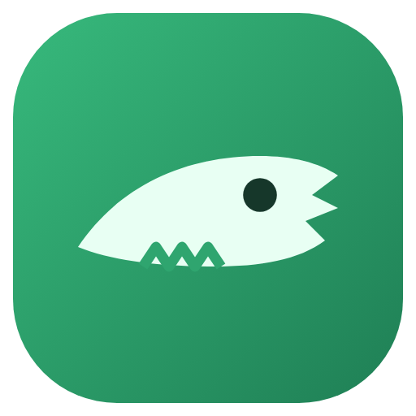
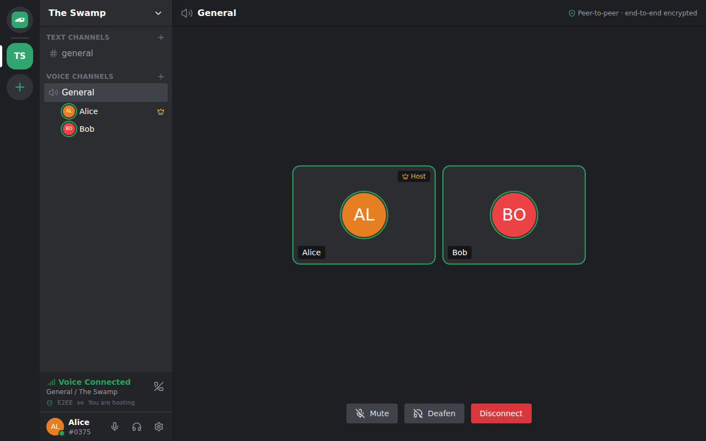

<p align="center"></p>

# Crocodile

**Peer-to-peer, end-to-end encrypted voice and text chat.** It works like
Discord or TeamSpeak (spaces, text and voice channels, friends, DMs, calls),
but your voice and messages go only between the people in the conversation.
Servers never see them.

- **Always E2E, always P2P.** Voice frames and messages are encrypted on your
  device with per-sender keys. For groups, the member with the best connection
  hosts a tiny relay that forwards ciphertext it cannot read, and a runner-up
  stands by to take over.
- **No passwords, no accounts to lose.** Your account is a key pair; you get a
  recovery key once. Pick a name and you're in.
- **Community-run coordination.** Volunteer coordination servers introduce
  peers, elect hosts and replicate _signed_ public metadata among themselves.
  Your app picks the fastest one automatically and keeps a backup.
- **Anyone can contribute a server.** Tick "Host a coordination server" in the
  app, or run it with Docker.

<p align="center"></p>

## Install

Download the installer for your system from
[Releases](https://github.com/pwalda/crocodile/releases): `Crocodile Setup.exe`
(Windows), `Crocodile.dmg` (macOS), `.AppImage` / `.deb` / `.rpm` (Linux). Open
it. There is nothing to configure. Updates install themselves.

Mobile apps are on the [roadmap](docs/ROADMAP.md).

## How it works

```
directory ──► list of coordination servers ──► your app picks the fastest
coordination servers (mesh) ── signed metadata, presence, signalling, host election
peers ── WebRTC to the elected host's relay, carrying E2E-encrypted frames
```

Read [ARCHITECTURE.md](ARCHITECTURE.md) for the full design and
[docs/SECURITY.md](docs/SECURITY.md) for the threat model.

## Repository layout

| Path                   | Contents                                                                          |
| ---------------------- | --------------------------------------------------------------------------------- |
| `apps/desktop`         | Electron app (React + Tailwind UI) and packaging                                  |
| `apps/directory`       | Directory service                                                                 |
| `packages/coordinator` | Coordination server (library + `crocodile-coordinator` CLI + Dockerfile)          |
| `packages/relay`       | Host relay (SFU run by the elected host peer)                                     |
| `packages/client-core` | Platform-neutral client logic, E2E layer, voice engine                            |
| `packages/crypto`      | Identities, signed records, sealed boxes, sender keys                             |
| `packages/protocol`    | Wire formats and schemas                                                          |
| `tests`                | Integration tests: server mesh, clients, real-browser WebRTC, Electron smoke test |

## Development

Requirements: Node.js 22+, pnpm 10 (`corepack enable`).

```sh
pnpm install
pnpm typecheck
pnpm test                      # unit + integration (+ Chromium E2E if available)

# Run a local directory and coordination server, then the desktop app against them
pnpm dev:directory             # :7400  (set CROC_DIR_ALLOW_PRIVATE=1 for LAN URLs)
pnpm dev:coordinator -- --directory http://127.0.0.1:7400 --public-url http://127.0.0.1:7443
CROC_DIRECTORIES_OVERRIDE=http://127.0.0.1:7400 pnpm dev:desktop
```

Useful extras:

- `CROC_USER_DATA=/tmp/croc-b pnpm dev:desktop` starts a second, independent
  instance for local testing.
- `xvfb-run -a npx tsx tests/electron/smoke.ts /tmp/shots` drives two real
  Electron instances through onboarding, invites, chat and voice and saves
  screenshots.
- `pnpm --filter @crocodile/desktop dist` builds installers for the current OS.

## Self-hosting a coordination server

```sh
CROC_PUBLIC_URL=https://croc.example.org \
CROC_DIRECTORY=https://directory.example.org \
docker compose up -d coordinator
```

It needs TCP and UDP on port 7443. See [docs/SELF_HOSTING.md](docs/SELF_HOSTING.md).

## License

Apache-2.0 OR MIT.
